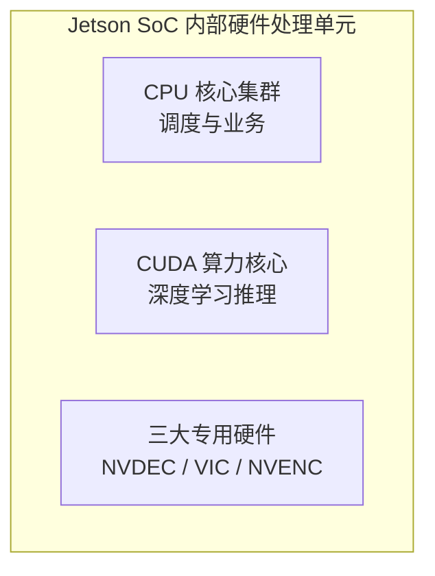

> **Key Takeaways**
> 1. **选型定位**：面对同时包含网络拉流、算法画框和 MP4 封装的边缘工况，Jetson 上的 GStreamer 多媒体组件是兼顾开发效率与硬件加速的最优解；
> 2. **双向硬件卸载**：前端通过 `nvv4l2decoder` 硬件解码释放 2 到 3 个 CPU 核心，后端通过 `nvv4l2h264enc` 硬件编码将落盘时延压缩 74%，单帧编码耗时从 129ms 降至 27ms；
> 3. **生产级防护**：硬件处理需兼顾 32 位 BGRx 内存对齐，配置四级降级矩阵以兼容无 NVENC 的机型，并在写盘后做文件大小嗅探，避免硬件异常时写出空文件。

## 目录

- [一、背景与问题：为什么边缘端必须做硬件编解码？](#一背景与问题为什么边缘端必须做硬件编解码)
- [二、Jetson 官方视频接口与底层硬件机制](#二jetson-官方视频接口与底层硬件机制)
  - [1. 官方四层接口体系与 GStreamer 选型](#1-官方四层接口体系与-gstreamer-选型)
  - [2. GStreamer 管道如何直通专用硬件硅片？](#2-gstreamer-管道如何直通专用硬件硅片)
- [三、输入端改造：拉流从 CPU 软解切到 NVDEC](#三输入端改造拉流从-cpu-软解切到-nvdec)
- [四、输出端改造：切片从 CPU 软编切到 NVENC](#四输出端改造切片从-cpu-软编切到-nvenc)
  - [1. 打通 memory:NVMM 连续显存池与编码管道](#1-打通-memorynvmm-连续显存池与编码管道)
  - [2. 工业级自适应降级矩阵](#2-工业级自适应降级矩阵)
  - [3. 防御硬件静默丢帧](#3-防御硬件静默丢帧)
- [五、实测对比与总结](#五实测对比与总结)

## 一、背景与问题：为什么边缘端必须做硬件编解码？

在轨道交通车载监控、智慧交通或工业质检场景中，边缘计算主机承担着毫秒级的缺陷检测任务（详细工程案例可参考我们的 [工业级缺陷检测系统复盘](/blog/pantograph-system-project-retrospective)）。整套系统的数据流转可以梳理为以下链路：


*图 1：边缘端视频与算法处理流水线*

在这套流水线上，视频切片通常对应两类业务任务：
1. **常规巡检切片**：每 10 分钟生成一段标准 MP4 视频，连续存盘供历史归档和事后追溯；
2. **事件取证切片**：算法一旦检测到异物、放电或结构形变，系统需要提取告警发生前 10 秒（来自环形内存缓存）至告警发生后 10 秒（共 20 秒）的关联切片。

在早期实现中，很多开发者倾向于直接调用 OpenCV 的默认接口：读流用 `cv2.VideoCapture(url)`，写视频用 `cv2.VideoWriter(..., cv2.VideoWriter_fourcc(*'mp4v'), ...)`。这套方案在个人电脑或实验室内功能完全正常，但放到资源受限的嵌入式工控机上，会暴露出明显的系统级冲突：

* **输入端软解抢占核心**：OpenCV 默认调用 FFmpeg CPU 软解 H.264。单路 1080P@25FPS 的视频解码就会持续占满 2 到 3 个 ARM CPU 核心；
* **输出端软编瞬间跑满**：当告警触发启动切片时，CPU 软件编码器会瞬间拉高剩余核心的使用率；
* **操作系统调度抖动**：多核满载导致操作系统分配给图像预处理、进程间通信和模型前向调度的运行时间片被挤压。原本稳定的 30ms 推理周期经常突增至 80ms 以上，造成算法偶发丢帧。

解决这个问题的根本方法，是将视频解码和编码全部从通用 CPU 上卸载，交给芯片内部独立的硬件单元处理。

## 二、Jetson 官方视频接口与底层硬件机制

很多初学者容易把桌面端的视频开发经验套用到 Jetson 上，误以为可以随意调用 NVIDIA Video Codec SDK 或各种开源库。实际上，NVIDIA 针对 Jetson 嵌入式架构有一套非常清晰的官方接口分工。关于 Jetson 的基础命令和流媒体测试，推荐阅读 [Jetson 硬件命令与 RTSP 指南](/blog/jetson-hardware-commands-and-rtsp-guide) 补充前置知识。

### 1. 官方四层接口体系与 GStreamer 选型

在 [NVIDIA 官方技术博客](https://developer.nvidia.com/blog/nvidia-jetpack-7-2-1-adds-agentic-video-skills-and-t3000-emulation/) 针对 JetPack 视频工作流的技术梳理（Table 1）中，Jetson 平台提供了四个不同层级的编程接口：

| 接口名称 | 定位与控制粒度 | 典型应用场景 |
| :--- | :--- | :--- |
| **[GStreamer](https://gstreamer.freedesktop.org/)** | 高层管道组装，模块化多媒体图 | 适合需要组合网络拉流、硬件变换、滤镜及容器封装（MP4/MKV）的完整应用 |
| **[V4L2 (Video4Linux2)](https://docs.kernel.org/userspace-api/media/v4l/v4l2.html)** | 底层设备与缓冲区控制 | 适合需要精细控制摄像头硬件设备节点、驱动寄存器或自定义驱动调优的场景 |
| **[Video Codec SDK](https://developer.nvidia.com/video-codec-sdk)** | C/C++ 底层直调接口 | 针对 NVENC/NVDEC 硬件特性的底层微观参数调控，网络传输与封装需自行开发 |
| **[PyNvVideoCodec](https://developer.nvidia.com/pynvvideocodec)** | Python 显存直通接口 | 专为 AI 训练与推理设计，直接把解码帧以 CUDA 设备指针交给 PyTorch |

在这个分工体系下，GStreamer（高层多媒体管线框架）是本项目场景的最优解。决定选型的核心是实际业务复杂度：
1. **输入端需要网络容错**：RTSP 拉流不仅涉及 H.264 解码，还需要处理网络丢包、TCP/UDP 协议协商和自动重连；
2. **中间层有 Python 业务逻辑**：算法检测结果需要叠加车次、车厢号等中文字体水印，并在内存环形队列中暂存；
3. **输出端需要合规容器封装**：生成的事故取证视频必须是标准的 MP4 容器格式，并能被地面录像服务器直接解析。

如果使用纯底层 C++ 接口，团队需要自行编写大量的协议解析与时间戳重整代码。因此，基于 GStreamer 的多媒体组件（Multimedia Components）是工程落地最具确定性的选择。

### 2. GStreamer 管道如何直通专用硬件硅片？

在桌面 PC 上，开发者更习惯用 FFmpeg。但在嵌入式领域，NVIDIA 官方将 GStreamer 作为一等公民，其核心优势在于**插件化解耦与硬件直通**。

要理解这一点，必须清楚 Jetson 芯片底层的物理硬件划分。这也深刻影响着大型多模态模型在边缘端的落地（相关讨论见 [Jetson Orin 大模型部署深潜](/blog/jetson-orin-qwenvl-deployment-deepdive)）。视频处理并不是由通用 CPU 核心或 GPU 算力核心模拟执行的，而是由蚀刻在硅片上的**独立硬件单元**负责：


*图 2：Jetson SoC 内部硬件处理单元与三大专用硅片划分*

* **NVDEC**：硬件视频解码器，专职 H.264/H.265 解码；
* **VIC（视频图像合成器）**：专职硬件图像转换，负责缩放和色彩空间转换；
* **NVENC**：硬件视频编码器，专职压缩编码。

在 Python OpenCV 中，开发者只需传入一段拼接好的 GStreamer 管道字符串。OpenCV 就会在后台拉起 Jetson 专用的 `nv*` 硬件加速插件（如 `nvv4l2decoder`），这些插件底层直接驱动上述三大专用硅片，完全绕开应用层的数据搬运。


*图 3：Jetson GStreamer 全链路编解码管道与专用硬件直通架构*

## 三、输入端改造：拉流从 CPU 软解切到 NVDEC

梳理清楚接口与硬件分工后，首先重构前端网络拉流链路。原有的 OpenCV `VideoCapture` 软解链路会将网络解包与视频帧解码全部挤在 CPU 线程中。现在的改造思路，是将这一过程完全移入 GStreamer 硬件流水线：

```python
def create_rtsp_capture_pipeline(rtsp_url: str) -> str:
    """构建输入端 NVDEC 硬件解码流水线"""
    return (
        f"rtspsrc location={rtsp_url} latency=100 protocols=tcp ! "
        f"rtph264depay ! h264parse ! "
        f"nvv4l2decoder ! " # 1. 硬件解码：由 NVDEC 硅片直接处理
        f"nvvidconv ! video/x-raw, format=BGRx ! " # 2. 硬件转换：VIC 硬件将 YUV 转为 32 位 BGRx
        f"videoconvert ! video/x-raw, format=BGR ! " # 3. 内存转换：向下兼容 OpenCV
        f"appsink drop=true sync=false max-buffers=2"
    )
```

**⚠️ 硬件总线约束：VIC 的 32 位字节对齐**
在上述流水线的第 2 步和第 3 步，你可能会好奇为什么不直接输出 `BGR`。这是因为 VIC 图像处理引擎的 DMA 控制器为了保证高速突发传输，强制要求输入/输出数据的每一行按 **32 位（4 字节）对齐**。OpenCV 默认的 3 通道 BGR 图像每个像素占用 24 位（3 字节），破坏了硬件的对齐规则。
因此，我们必须在流经 VIC 硬件时使用 4 通道的 `BGRx`（补齐一个空的 Alpha 字节），然后再用轻量的 `videoconvert` 去掉它，以兼容后端的 OpenCV。

**改造收益**：单路 1080P@25FPS 拉流进程 CPU 占用率从 150%+ 降至 10% 以下，彻底消除了网络拉流过程对核心算法线程的干扰。

## 四、输出端改造：切片从 CPU 软编切到 NVENC

后端的任务是把算法渲染后的图像（叠加了 HUD 水印和告警框）打包成标准 MP4 文件。这里不仅涉及硬件编码器，还必须遵循 Jetson 特有的内存契约。

### 1. 打通 memory:NVMM 连续显存池与编码管道

Jetson 采用统一内存架构（UMA），但这并不意味着任意内存指针都能被硬件高速读取：
* **Host RAM（普通系统内存）**：物理地址离散，是操作系统分配的标准分页内存。
* **`memory:NVMM`（连续多媒体显存池）**：由底层多媒体驱动分配的物理连续内存。

VIC 与 NVENC 底层的硬件控制器**只认连续显存**。如果在 GStreamer 管道中漏掉了 `memory:NVMM` 标记，系统会强行在 Host 内存与硬件驱动间反复搬运数据，彻底拖垮 CPU。因此，我们在输出管道中必须显式声明并注入 NVMM：

```python
def create_hardware_video_pipeline(output_path: str, fps: float, w: int, h: int) -> str:
    """构建输出端 NVENC 硬件编码落盘流水线"""
    return (
        f"appsrc ! video/x-raw, format=BGR ! "
        f"videoconvert ! video/x-raw, format=BGRx ! " # 满足 VIC 的 32 位对齐
        f"nvvidconv ! video/x-raw(memory:NVMM), format=NV12 ! " # 注入 NVMM 连续显存池
        f"nvv4l2h264enc bitrate=4000000 maxperf-enable=1 preset-level=1 ! " # NVENC 硬件编码
        f"h264parse ! mp4mux ! "
        f"filesink location={output_path} sync=false"
    )
```

调用时将该管道传入 `cv2.VideoWriter`，指定 `cv2.CAP_GSTREAMER` 后端，编码过程就能完全由 NVENC 接管。

### 2. 工业级自适应降级矩阵

复杂的现场工况下，单一管道存在隐患（例如较低端的 Jetson Orin Nano 在芯片层物理去掉了 NVENC 编码器）。必须设计四级自适应候选工厂：

1. **NVMM全硬件**：全栈硬件零拷贝（AGX Orin 主力）；
2. **I420硬件降级**：硬件编码退回 I420 协商；
3. **x264enc极速软编**：GStreamer CPU 极速软编（Nano 机型自动回退）；
4. **mp4v通用保底**：纯软件 `mp4v` 编码，确保 100% 可用。

> 注意：OpenCV FFmpeg 遇到 `avc1` 会调取有兼容风险的内核驱动，每秒刷出几十条错误日志，因此第四级保底明确选用通用的 `mp4v`。

### 3. 防御硬件静默丢帧

生产中最危险的是无报错的静默失败。NVENC 异常时会生成 0 字节的空文件，导致关键事故证据丢失。
防御逻辑是在 `writer.release()` 后进行**体积嗅探**。若临时文件低于 1KB，立即启动 CPU 纯软编重新烘焙，然后再做原子重命名（`os.replace`），确保外部服务读取到的必定是完整视频。

## 五、实测对比与总结

在加固工控机（NVIDIA Jetson AGX Orin 64GB）上，针对 200+ 帧 1080P@30FPS 视频切片进行实测，数据对比如下：


*图 4：边缘端硬件视频编解码性能基准对比：软编保底 vs 极速软编 vs 全硬件零拷贝*

| 指标 | 软编保底 (`mp4v`) | 极速软编 (`x264enc`) | 全硬件 (`nvv4l2h264enc + NVMM`) | 全硬件相比软编收益 |
| :--- | :--- | :--- | :--- | :--- |
| **单帧编码耗时** | 129.2 ms | 56.4 ms | 26.9 ms | **4.8× 提速** |
| **200+ 帧切片落盘** | 26.8 s | 12.1 s | 6.9 s | **时延压缩 74%** |
| **单路 CPU 占用** | 380~480% | 200% | < 3% | **负载释放 99%+** |

### 总结

在边缘设备构建视频处理系统，核心原则是：
1. 避免通用 CPU 处理密集数据搬运；
2. 采用 GStreamer 多媒体组件处理网络与封装；
3. 遵守内存对齐（`BGRx`）与连续显存（`memory:NVMM`）契约，打通专用硬件加速；
4. 配套降级校验矩阵，保障系统在工业恶劣环境下的容灾健壮性。

<script type="application/ld+json">
{
  "@context": "https://schema.org",
  "@graph": [
    {
      "@type": "BlogPosting",
      "headline": "《边缘端硬件视频编解码实践》",
      "image": [
        "/images/blog/gstreamer-pipeline-concept.svg",
        "/images/blog/edge-video-encoding-benchmark.svg"
      ],
      "datePublished": "2026-09-28T00:00:00+08:00",
      "dateModified": "2026-09-29T16:18:00+08:00",
      "author": {
        "@type": "Person",
        "name": "Jing Frank"
      },
      "publisher": {
        "@type": "Organization",
        "name": "Jing Frank's Blog",
        "logo": {
          "@type": "ImageObject",
          "url": "/images/logo.png"
        }
      },
      "description": "记录在 Jetson 嵌入式平台上将视频编解码全链路卸载至硬件专用硅片的工程实践，打通 NVMM 零拷贝与容灾降级。"
    },
    {
      "@type": "BreadcrumbList",
      "itemListElement": [
        {
          "@type": "ListItem",
          "position": 1,
          "name": "Home",
          "item": "https://jingfrank.github.io/"
        },
        {
          "@type": "ListItem",
          "position": 2,
          "name": "Blog",
          "item": "https://jingfrank.github.io/blog"
        },
        {
          "@type": "ListItem",
          "position": 3,
          "name": "边缘端硬件视频编解码实践"
        }
      ]
    }
  ]
}
</script>
