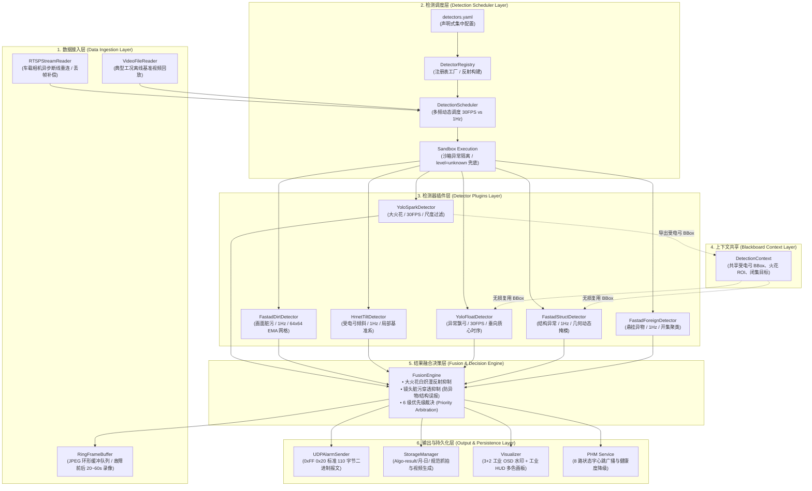

> **项目导读**：
> 
> 在此前的一系列文章中，我们从单点技术视角深入复盘了 ARM64 底层软件栈移植、vLLM 推理加速、FastAD 毫秒级无监督初筛以及跨窗口时序滤波等核心攻坚战。然而，工业落地从来不是单点算法的“独角戏”，而是一场包含**行业标准对齐、软硬件拓扑协同、业务防御闭环、端侧极限优化与不可变交付**的系统工程。
> 
> 本文跳出“技术怎么调、Bug 怎么解”的微观视角，全面对标行业成熟商用标准（以**苏州华启智能科技《弓网智能分析系统》（HQ-TSW-PIA-01A）**为基准），系统复盘整个项目从立项选型、四代技术演进、三大攻坚战役、工业规则闭环到规模商用交付的全周期工程实践。
> 
> 📌 **航母编队支撑专题（点击可深潜底层代码与实战细节）**：
> * **👉 底层底座：[【实战】Jetson 硬件底座特有查询指令与 RTSP 联调踩坑全景](/blog/jetson-hardware-commands-and-rtsp-guide)**
> * **👉 边缘底座：[【系列一】Jetson Orin 部署 Qwen-VL 踩坑实录与底层软件栈断层复盘](/blog/jetson-orin-qwenvl-deployment-deepdive)**
> * **👉 多模态算法：[【系列二】动静分离两阶段 VLM 架构与跨窗口时序一致性滤波实战](/blog/pantograph-vlm-twostage-algorithm)**
> * **👉 推理加速：[【系列三】从 5.5s 到 1.06s：基于 vLLM 与推测并发的高性能推理优化实战](/blog/vllm-inference-acceleration-benchmark)**
> * **👉 几何姿态：[【实战】受电弓姿态倾斜监测：从 HRNet 刚性关键点解耦到局部基准系抗误报全景](/blog/pantograph-geometric-tilt-detection-hrnet)**

---

## 目录

- [一、业务全景与工业级标准对齐（The Big Picture）](#一业务全景与工业级标准对齐the-big-picture)
- [二、车载硬件与网络系统拓扑设计](#二车载硬件与网络系统拓扑设计)
- [三、四代架构演进与技术路线推演（Architecture Evolution）](#三四代架构演进与技术路线推演architecture-evolution)
- [四、多故障融合方案与 6 层插件化分层架构设计](#四多故障融合方案与-6-层插件化分层架构设计)
  - [4.1 四大核心设计原则（解耦、统一接口、资源集中管理、配置驱动）](#41-四大核心设计原则)
  - [4.2 6 层插件化分层架构全景拓扑](#42-6-层插件化分层架构全景拓扑)
  - [4.3 6 大故障检测插件协同矩阵](#43-6-大故障检测插件协同矩阵)
  - [4.4 跨模块互斥抑制与融合仲裁机制](#44-跨模块互斥抑制与融合仲裁机制)
  - [4.5 异常飘弓（Abnormal Float）深度解析：零计算复用与 TCMS 状态机融合](#45-异常飘弓abnormal-float深度解析零计算复用与-tcms-状态机融合)
- [五、工业级业务闭环机制的工程落地](#五工业级业务闭环机制的工程落地)
  - [5.1 机制一：报警（Alarm）与预警（Warning）双轨分级](#51-机制一报警alarm与预警warning双轨分级)
  - [5.2 机制二：全场景防误报与环境鲁棒性设计](#52-机制二全场景防误报与环境鲁棒性设计)
  - [5.3 机制三：报警消抖与去重机制（Deduplication & Debouncing）](#53-机制三报警消抖与去重机制deduplication--debouncing)
  - [5.4 机制四：预置位门控与镜头脏污自愈机制](#54-机制四预置位门控与镜头脏污自愈机制)
- [六、三大关键战役攻坚复盘（Key Battles）](#六三大关键战役攻坚复盘key-battles)
  - [6.1 战役一：时延攻坚战（从 5,500ms 到 45ms 的百倍跨越）](#61-战役一时延攻坚战从-5500ms-到-45ms-的百倍跨越)
  - [6.2 战役二：虚警歼灭战（从“误报频频”到“600 秒长时序零虚警”）](#62-战役二虚警歼灭战从误报频频到600-秒长时序零虚警)
  - [6.3 战役三：交付工程战（从“环境地狱”到“3 分钟一键幂等上线”）](#63-战役三交付工程战从环境地狱到3-分钟一键幂等上线)
- [七、核心收益与量化指标全景矩阵](#七核心收益与量化指标全景矩阵)
  - [7.1 四维立体评估体系与基准数据集构建](#71-四维立体评估体系与基准数据集构建)
  - [7.2 华启工业规范 5 大故障专项评测实测数据](#72-华启工业规范-5-大故障专项评测实测数据)
  - [7.3 边缘计算资源与时延加速矩阵](#73-边缘计算资源与时延加速矩阵)
  - [7.4 工业车载现场验收必须测试的“核心数据清单”](#74-工业车载现场验收必须测试的核心数据清单the-field-verification-checklist)
- [八、失败教训与工程反思（What Didn't Work）](#八失败教训与工程反思what-didnt-work)
- [九、工业边缘 AI 落地方法论沉淀](#九工业边缘-ai-落地方法论沉淀)

---

## 一、业务全景与工业级标准对齐（The Big Picture）

### 1.1 行业背景：350 km/h 供电生命线

在我国高铁干线网络中，CR400 复兴号动车组以 350 km/h 的速度飞驰。列车唯一的动力源泉，是通过车顶**受电弓（Pantograph）**碳滑板以数十牛顿的接触压力，紧密贴合在悬挂于空中的 25kV 高压**接触网（Catenary）**导线上取流。

这套“弓网系统”处于全裸露的高空强电磁与高速风阻环境中，是动车组运行链条中最脆弱的一环：
* 碳滑板若发生局部开裂、严重磨耗或弓角缺失，极易拉扯刮断高压接触网；
* 挂附在弓头上的风筝线、编织袋、防尘网或树枝等外来异物，会在高压下引发恶性短路拉弧甚至引发火灾；
* 一旦发生重大“钻弓、剐网”事故，不仅单列列车瞬间失去牵引动力停运，还会导致整条繁忙干线双向断电瘫痪数小时，直接社会经济损失不可估量。


*图 1：动车组“弓网智能分析系统”全景架构、华启工业规范 5 大故障闭环与四代算法演进矩阵*

### 1.2 工业规范对齐：苏州华启智能 HQ-TSW-PIA-01A 标准解析

工业视觉与消费级 AI 最大的分水岭在于：**工业项目必须遵循严格、明确且带有法律与安全责任的行业产品规范**。

在自研“弓网智能分析系统”之初，我们深入调研了轨道交通 PIS 与车载安全监控领军企业——[苏州华启智能科技的商用软件规范（产品型号：HQ-TSW-PIA-01A）](https://huaqi.info/software/8.html)。华启规范对“弓网智能分析系统”的功能边界与判据指标给出了非常具象、量化的定义，这也成为我们自研系统全周期攻坚的核心准绳：

| 华启标准故障大类 | 行业规范量化判据要求 | 业务严重级别 | 误报容忍度 | 现实工程核心挑战 |
| :--- | :--- | :--- | :--- | :--- |
| **01. 大火花检测** | 火花面积超过弓头区 **1/20** 且持续 **700ms** 以上 | **预警 (Warning)** | 低 | 滤除刚柔过渡微小火花与过分相区瞬态脉冲 |
| **02. 受电弓倾斜** | 受电弓倾斜角度大于标准 **5°** 且持续超 **3s** | **报警 (Alarm)** | 极低（零容忍） | 克服列车过弯外轨超高倾角与相机滚转抖动 |
| **03. 结构异常检测** | 弓角变形缺失、碳滑板断裂扭转持续超 **3s** | **报警 (Alarm)** | 极低（零容忍） | 现场极度缺乏正样本，必须具备未定义缺陷捕捉能力 |
| **04. 悬挂异物检测** | 弓头区域检测到大于 **10cm × 10cm** 异物持续超 **3s** | **报警 (Alarm)** | 极低（零容忍） | 开集未知物体识别，抵御隧道背景线条与站台灯光干扰 |
| **05. 画面脏污自检** | 镜头污损导致无法识别弓头持续超 **3 分钟** | **预警 (Warning)** | 中 | 避免脏污被持续误判为异物，具备降级与自愈机制 |

### 1.3 车载边缘端的“四大极限约束”

在云端服务器上运行 AI 模型是一件轻松的事，但将其搬上动车组机柜，必须正面硬抗四大极限约束：
1. **硬实时性约束**：工业相机输出 20~25 FPS 连续视频流，紧急报警从视频采集到驾驶室声光响应端到端延迟必须 $\le 500$ ms，常规初筛单帧耗时必须压在 50 ms 以内；
2. **完全物理断网（Air-Gapped）**：车载计算节点严禁访问公网，所有依赖库、模型权重、驱动环境、守护程序必须 100% 离线自闭环；
3. **恶劣物理工况**：列车全天候经历暴雨、大雪、大雾、隧道进出黑白瞬变、站台强反光；硬件机柜需承受长期震动、宽温变（-25℃ ~ +70℃）以及 **60W 边缘计算功耗墙**；
4. **统一内存争抢（UMA）**：嵌入式平台（如 Jetson AGX Orin）CPU 与 GPU 共享物理内存。一旦大模型或视频帧缓冲区发生内存泄露，将引发 Linux OOM-Killer 瞬间摧毁整个车载安全进程。

---

## 二、车载硬件与网络系统拓扑设计

动车组的安全系统必须具备清晰的硬件边界与容错冗余。根据中车标准地铁与动车组统型技术规范，我们将全系统划分为车顶采集、网络汇聚、边缘智算与司机室终端四大物理区域：

### 2.1 物理与网络设备组成
* **车顶受电弓摄像机（Roof Camera）**：
  * 安装于车顶高压安全距离之外，配置特种耐高压防静电护罩；
  * 采用宽动态低照度工业图像传感器，支持高速硬件电子快门以冻结 350 km/h 运动模糊；
  * 配备电动变焦与预置位锁定（Preset Lock），通过千兆航插网线向车厢输出 25 FPS RTSP/H.264/H.265 码流。
* **车载工业以太网交换机（Train Switch）**：
  * 采用符合 EN 50155 轨交标准的车载百兆/千兆交换机，支持环网冗余协议（MRP/RSTP）；
  * 划分专用 VLAN，隔离乘客 PIS 媒体流与受电弓安全监控码流，启用 802.1p QoS 高优先级排队。
* **受电弓视频监控服务器（NVR-1U）**：
  * 设于邻近车厢设备柜，执行 7×24 小时原始视频连续录像存盘与客室 CCTV 统型复用；
  * 存储周期满足铁总规定的 30 天安全追溯要求。
* **智能分析主机（AI Edge Host）**：
  * 采用 1U 车载机架式加固工控机，核心搭载 **NVIDIA Jetson AGX Orin（64GB 统一内存，275 TOPS INT8 算力）**；
  * 部署全套自研离线 Docker 容器化推理服务，承担从毫秒级特征初筛到大模型异步研判的全量计算。
* **司机室监控屏（Cab HMI）与 TCMS 联动**：
  * 驾驶台配备 10.4 / 12.1 寸车载工业级防眩光触控屏；
  * 一旦发生“红色报警”，边缘主机通过 UDP 专用二进制协议（`0xFF 0x20` 帧头）直发监控屏弹窗，联动警蜂鸣器鸣叫，并向 **TCMS（列车控制与管理系统）** 与 **PHM（车载健康管理平台）** 推送状态诊断包。

---

## 三、四代架构演进与技术路线推演（Architecture Evolution）

任何高可靠工业系统的诞生，都不是一蹴而就的“顶层预设”，而是一场在现实毒打中不断推翻重来的演进史。在过去两年的研发过程中，我们的核心算法架构经历了四代跨越：

```
[Gen 1.0 传统 YOLO] ──(闭集漏检/正样本为0)──> [Gen 2.0 纯端侧 VLM]
                                                    │
                                             (5.5s阻塞/算力超限)
                                                    │
                                                    ▼
[Gen 4.0 异构三层商用终态] <──(前端初筛仍过重)── [Gen 3.0 动静两阶段+滤波]
 (FastAD + 状态机 + VLM)
```

### 3.1 第一代：传统目标检测（YOLO 闭集）的黄昏

在项目早期，业界普遍采用经典的深度学习目标检测方案（如 YOLOv5 / YOLOv8 / Faster-RCNN）：
* **方案设想**：采集现场图片，标注碳滑板、羊角、拉弧、塑料袋等类别进行监督学习训练。
* **致命崩塌点**：
  1. **正样本极端匮乏**：在真实的动车组运行中，受电弓断裂、严重倾斜、掉块属于百万分之一概率的恶性事故，根本采集不到足够数量的高质量真实标注样本；
  2. **开集未知异物无法定义**：挂在受电弓上的异物五花八门——从半透明农用塑料膜、编织袋、铝箔风筝线到缠绕树枝。闭集检测器对未标注类别的异物漏检率高达 60% 以上；
  3. **复杂环境高频虚警**：夜间进出站台时，钢轨地面的高反射聚光灯经常被误检为“大火花”；雨雪飞溅和接触网分相绝缘子经常触发“结构变形”假报警，司机苦不堪言。
* **结论**：传统监督学习目标检测无法满足“零漏检、极低虚警”的严苛安全准入标准。

### 3.2 第二代：纯端侧端到端视觉大模型（VLM）的碰壁

2024 年视觉语言大模型（VLM）爆发，其强大的开放词表理解（Open-Vocabulary）和通识推理能力让团队看到了破局希望：
* **方案设想**：直接在车载 Jetson Orin 上部署开源多模态模型（如 Qwen2-VL / Qwen3-VL），每采样若干帧即向大模型提问：“请分析当前受电弓是否存在火花放电、几何变形或悬挂异物，并输出异常坐标”。
* **致命崩塌点**：
  1. **5.5 秒时延黑洞**：在未经深度优化的嵌入式端侧，单次多图前向推理长达 5,500 ms。对于 25 FPS 连续视频流，意味着只能每隔 5~6 秒“管中窥豹”看一次，其间掠过的数秒高速严重缺陷完全漏过；
  2. **Token 爆炸与显存穿透**：连续送入多张 1080P 高清帧导致 Vision Encoder 计算量激增，KV Cache 瞬间吃满 Jetson 显存；
  3. **单帧静态幻觉（Hallucination）**：单帧图像中的强烈反光光斑或悬空绝缘子，经常被大模型误脑补为“塑料异物”，产生频繁误报。
* **结论**：脱离工程约束的“端到端大模型”，在工业边缘端是一场灾难。

### 3.3 第三代：动静分离两阶段（Two-Stage）与空间时序滤波网关

为了压降 Token 数量并根除瞬态误报，我们提出了**“动静分离”两阶段流水线**：
* **核心思想**：
  * **Stage 1（动态时序感知）**：将输入帧降采样至 640P，累计 4 帧图像（代表 4 秒时序），仅让大模型判断是否存在“大火花”或“画面脏污”等全局动态过程（Token 数锐减 75%）；
  * **Stage 2（静态高精定位）**：当且仅当 Stage 1 判定画面正常且无雾时，才截取最后一帧 960P 原图，让模型输出异物精确点坐标 `<point>x, y</point>`；
  * **抗虚警网关（Temporal Tracker）**：引入跨窗口空间-时序一致性追踪器。只有同一个异物坐标在连续 2 个独立滑动窗口（时间跨度 > 3s）中几何距离 $\Delta D \le 35$ 像素，才确诊告警。
* **阶段性成果**：
  * 成功将单次推理时延优化至 1.06 秒（结合 vLLM 并发加速），误报率压降 95% 以上；
  * 完美解决了长视频中 600 秒无故障工况下的零虚警难题。
* **残留痛点**：
  * 1.06 秒的时延虽然优秀，但面对车载 20~25 FPS 的连续视频流，仍属于“抽检模式”，无法做到对每一个视频帧进行“逐帧毫秒级安全门禁筛查”。

### 3.4 第四代（终极商用形态）：FastAD + 物理状态机 + VLM 异构三层协同

最终在规模商用中落地的，是一套**异构解耦、各司其职的三层协同架构**：

```
25 FPS RTSP 原始流 
     │
     ▼
┌─────────────────────────────────────────────────────────────┐
│ Layer 1: FastAD 极速无监督初筛网关 (45ms / 逐帧实时运行)       │
│ • ResNet18 浅层特征提取 (Layer 2 降维)                       │
│ • 仅在“纯正常样本流形”上拟合 Memory Bank                      │
│ • 马氏距离空间度量：未定义未知异常 100% 激增触发                │
└──────────────────────────────┬──────────────────────────────┘
                               │ 异常分 Score > Threshold
                               ▼
┌─────────────────────────────────────────────────────────────┐
│ Layer 2: 几何先验与空间时序状态机 (物理熔断与消抖)            │
│ • HRNet-W32 四刚性铰点解耦：SO(2) 局部基准系解算倾角 (>5°)    │
│ • 时间窗口消抖 (持续 3 秒确诊 / 700ms 大火花门控)             │
│ • 预置位门控 (Preset Gating) 与镜头脏污自检熔断               │
└──────────────────────────────┬──────────────────────────────┘
                               │ 确诊恶性缺陷，需语义报告
                               ▼
┌─────────────────────────────────────────────────────────────┐
│ Layer 3: Qwen3-VL 开放多模态异步研判 (vLLM 推测并发引擎)      │
│ • 仅对异常切片按需触发，不阻塞主干视频流                      │
│ • 生成人类可读结构化结论：异物材质、挂附严重度、应急处置建议   │
└─────────────────────────────────────────────────────────────┘
```

* **架构哲学**：
  * **让快算法做粗活**：FastAD 仅消耗 45ms，以单类无监督算法卡死在系统最前端，负责拦截 99% 的绝对安全帧；
  * **让物理先验做裁决**：几何坐标变换与时序状态机负责消抖，过滤环境光电噪点与误报；
  * **让大模型做终审**：大模型从“全天候值守民警”转变为“特聘专家会诊”，只在出现重大疑难异常时介入几秒钟，完成深度语义归因与报告归档。

---

## 四、多故障融合方案与 6 层插件化分层架构设计

在受电弓网视频监控场景中，大火花、受电弓倾斜、画面脏污、异常飘弓、结构破损、悬挂异物 6 大类故障在物理特征、时空尺度和时间尺度上差异巨大：
* **大火花与异常飘弓**：属于高动态、快速爆发的毫秒级瞬态事件，必须在 30 FPS 视频流上逐帧捕捉；
* **结构开裂与悬挂异物**：属于几何特征微小的静态异常，极度依赖高清局部掩模与无监督特征重构；
* **画面脏污与受电弓倾斜**：属于跨秒级乃至跨分钟级的低频渐变或时序持久性状态，更依赖 64×64 时序 EMA 网格累积与下横梁刚体局部基准系解算。

在系统研发早期，团队曾将所有算法串行硬编码在一个大循环中，导致**“单一模型崩溃引发全系统雪崩”**、**“不同模型争抢 GPU 显存导致 OOM”**、**“新增一个故障类型必须大动干戈重构主程序”**。为此，我们全面重构了系统底座，设计并实现了**“多故障融合的 6 层插件化分层架构（Layered Plugin Architecture）”**。

### 4.1 四大核心设计原则（Core Architectural Principles）

为了支撑车载机载边缘环境下的高可用、易扩展与集中治理，本架构确立了四大不可动摇的核心设计原则：

```
┌─────────────────────────────────────────────────────────────┐
│ 多故障融合四大核心设计原则 (Core Design Principles)           │
├─────────────────────────────────────────────────────────────┤
│ 1. 解耦 (Decoupling)        ➔ 模块即插件，新增/替换变动零扩散 │
│ 2. 统一接口 (Unified API)   ➔ 协议契约化，上层调度无感化     │
│ 3. 资源集中管理 (Governance) ➔ 算力集约共享，UMA 统一硬限额   │
│ 4. 配置驱动 (Config-Driven) ➔ 逻辑与参数分离，现场免编译热启 │
└─────────────────────────────────────────────────────────────┘
```

#### 原则一：解耦（Decoupling）
* **插件自包含**：每一个检测模块均继承自抽象基类 `BaseDetector`，内部封装前处理、前向推理与后处理，各模块之间杜绝代码级直接引用与隐式依赖；
* **单模块变动零扩散**：新增故障类型（如后期引入“异常飘弓”）或替换现有模型（如将 HRNet 升级为轻量版 RTMPose），上层调度引擎、视频接入与输出持久化模块无需修改哪怕一行代码；
* **沙箱故障隔离（Sandbox Execution）**：每个检测器的 `run()` 执行由沙箱容器外包捕获。单个插件哪怕因输入张量异常或 GPU 显存颠簸抛出异常，会被沙箱捕获并优雅降级为 `status="UNKNOWN"`，绝不扩散拖垮整个车载安全监测主进程。

#### 原则二：统一接口（Unified Interface）
* **契约协议化**：所有检测器必须对外暴露完全相同、严格约束的标准输入输出数据协议：
  * **统一输入**：`FramePacket`（包含时间戳、绝对帧序号、图像句柄以及黑板共享上下文）；
  * **统一输出**：`DetectionResult`（严格规范化字段：`status` [NORMAL/WARNING/ALARM/UNKNOWN]、`confidence` 置信度、`bbox` 边界框、`keypoints` 关键点数组、`metadata` 辅助物理量）；
* **调度无感化**：上层调度器（`DetectionScheduler`）纯粹面向抽象协议编程，只负责管理任务分发与结果收集，**完全不需要、也不应该感知底层究竟是 YOLOv11、HRNet-W32、FastAD 还是多模态大模型**。

#### 原则三：资源集中管理（Centralized Resource Governance）
* **多频时钟分级调度**：杜绝 5~6 个模型各自开线程、无休止轮询 GPU。调度器实施分频治理：
  * **高频实时通道（30 FPS 逐帧调度）**：运行轻量级 `YoloSparkDetector`（大火花）与 `YoloFloatDetector`（异常飘弓），保证高动态故障毫秒响应；
  * **低频深研通道（1 Hz 周期调度）**：运行较重的 `HrnetTiltDetector`（倾斜姿态）、`FastadForeignDetector`（异物聚类）、`FastadStructDetector`（结构差分）与 `FastadDirtDetector`（脏污网格），算力消耗直接压降 90%；
* **上下文共享黑板（Blackboard Context）**：多个检测器之间通过 `DetectionContext` 共享前序计算成果。例如：YOLO 提取出的受电弓全局 BBox 和火花 ROI 直接写入黑板，后续的飘弓插件与结构异常插件无损复用该框作为感兴趣区域（ROI），**免除重复执行骨干网络特征提取**；
* **显存与 UMA 统一配额**：全局集中托管 PyTorch/TensorRT/CUDA 显存池，为 Tegra UMA 统一内存设置硬限额（显存占用稳锁在 80% 警戒线以内），为系统内核预留 8GB 绝对安全缓冲，杜绝各模型各自为政引发 OOM-Killer 暴毙。

#### 原则四：配置驱动（Configuration-Driven）
* **逻辑与参数彻底分离**：严禁将任何灵敏度阈值、网络开关、权重绝对路径硬编码在 Python 代码中；
* **声明式集中配置**：系统完全由 `config/detectors.yaml` 和 `config/config_prod.yaml` 集中驱动：
  ```yaml
  detectors:
    - name: "spark"
      type: "YoloSparkDetector"
      enabled: true                  # 动态启停开关
      stride: 1                      # 逐帧 30FPS 调度
      weights: "models/spark_v11.pt"
      alarm_thresh: 0.05             # 火花面积比 1/20
    - name: "tilt"
      type: "HrnetTiltDetector"
      enabled: true
      stride: 30                     # 1Hz 周期调度
      weights: "models/hrnet_w32.pth"
      warning_deg: 1.2
      alarm_deg: 1.8
  ```
* **免编译热启与 A/B 测试**：在车辆段调试或消融实验时，现场工程师只需按需修改 YAML 配置即可实现单故障关闭、阈值微调与模型切换，无需重新构建与推送 15GB 的 Docker 镜像。

---

### 4.2 6 层插件化分层架构全景拓扑

整个系统的分层流水线严格遵循“数据进、调度控、插件检、黑板传、融合决、持久出”的 6 层流转拓扑：



---

### 4.3 6 大故障检测插件协同矩阵

通过统一基类与注册机制，6 大核心故障检测插件协同运行于调度沙箱内：

| 故障插件名称 | 选用模型 / 算法机理 | 执行频率 | 共享黑板交互 | 核心判据与阈值 |
| :--- | :--- | :---: | :--- | :--- |
| **`YoloSparkDetector`** (大火花) | YOLOv11 目标检测 + 连通域色度分析 | **30 FPS (逐帧)** | 导出 `pantograph_bbox` 与 `spark_roi` 至黑板 | 火花面积 $> 1/20$ 弓头区，持续时长 $> 700$ ms |
| **`HrnetTiltDetector`** (受电弓倾斜) | HRNet-W32 四刚性关键点 + 局部浮动系 | **1 Hz (周期)** | 仅读取受电弓整体大致范围 | 局部相对偏角 $|\theta_{rel}| \ge 1.8^\circ$ 且持续 $> 3$ s |
| **`FastadDirtDetector`** (画面脏污) | FastAD + 64×64 网格时序 EMA 衰减累积 | **1 Hz (周期)** | 导出静止污染掩模 `dirt_mask` 供融合层拦截 | 特征消失持续超 3 分钟，挂起推理并触发预警 |
| **`YoloFloatDetector`** (异常飘弓) | 复用受电弓 BBox，双工况状态机 + 垂向质心时序差分 | **30 FPS (逐帧)** | 零计算读取黑板 `panto_bbox` + TCMS `is_panto_raised` | 垂向跳变速度 $> 40.0$ px/s 或降弓高度 $> 70.0$ px（双向步进消抖 $\ge 5$ 帧报警） |
| **`FastadStructDetector`** (结构异常) | FastAD 浅层特征重构差分 + 动态几何掩模 | **1 Hz (周期)** | 复用黑板 `pantograph_bbox` 自动扣除环境背景 | 空间异常评分突变且持续超 3 秒 |
| **`FastadForeignDetector`** (悬挂异物) | FastAD 接触网开集异常聚类检测 | **1 Hz (周期)** | 融合闭集候选，排除站台钢架结构反光 | 开集异物尺度 $\ge 10\times 10$ cm 且持续超 3 秒 |

---

### 4.4 跨模块互斥抑制与融合仲裁机制

当列车处于复杂受流工况时，不同检测模块极易产生“交叉污染”引发误报。融合决策引擎（`FusionEngine`）建立了三道强力互斥防线：

1. **大火花白炽漫反射抑制（Spark Glow Mutual Suppression）**：
   * 现场痛点：在离线大火花剧烈爆闪瞬间，全图照度激增几十倍，导致碳滑板与接触网瞬间白炽过曝，FastAD 结构差分和异物聚类极易产生连片异常误报；
   * 抑制策略：当 `YoloSparkDetector` 在当前帧判定触发大火花时，融合引擎立即向结构异常与悬挂异物插件注入“漫反射抑制标志”，强行压制本帧的结构告警，杜绝“火花引发结构损坏”假报警。
2. **镜头脏污穿透抑制（Dirt Occlusion Mutual Suppression）**：
   * 现场痛点：飞虫或油污撞击在镜头表面形成持久黑斑，若直接送入检测网络，结构异常检测器会误判为“碳滑板裂纹”，异物检测器会误判为“悬挂异物”；
   * 抑制策略：`FastadDirtDetector` 在 64×64 绝对机体坐标网格内建立长时衰减积分。一旦某像素区域被标记为“持续静止污迹”，融合引擎将该网格几何区域从异物与结构检测的候选集中直接剔除，确保脏污不穿透为恶性安全事故。
3. **6 级安全优先级仲裁（Strict Priority Arbitration）**：
   * 当同一视频帧被多个插件同时标记为异常时，系统按照对行车安全的紧急致命程度进行严密优先级裁决：
     $$\text{结构断裂 (P1)} > \text{悬挂异物 (P2)} > \text{受电弓倾斜 (P3)} > \text{异常飘弓 (P4)} > \text{大火花放电 (P5)} > \text{画面脏污 (P6)}$$
   * 确保推送至司机室监控屏与 TCMS 控制总线的始终是威胁等级最高、最紧急的故障代码与处置建议。

---

### 4.5 异常飘弓（Abnormal Float）深度解析：零计算复用与 TCMS 状态机融合

在 350 km/h 高速受流场景中，“异常飘弓（Abnormal Pantograph Float）”是危害等级仅次于结构断裂与大异物的恶性工况。在工程实现上，算法源码位于 [`core/detectors/float_detector.py`](file:///home/ibd/jyb/gongwang/core/detectors/float_detector.py)。该模块不仅体现了极致的端侧算力复用哲学，更展示了车载多模态状态机与双向步进滤波的工程严密性。

#### 4.5.1 物理机理与行车安全致命风险

为什么受电弓会发生“飘弓”？在流体动力学与机械动力学双重作用下，受电弓高速运行受到三大关键因素扰动：
1. **空气动力学负压与升力失衡**：当列车以 350 km/h 飞驰或遭遇强侧风、会车压力波时，弓头迎风面产生的空气动力升力剧烈波动，极易打破弓网间预设的 70~120 N 静态接触力；
2. **接触网硬点冲击共振**：接触网定位器、分相绝缘器处存在弹性不均匀的“机械硬点”，高速碰撞后受电弓产生大幅度上下高频反弹；
3. **气路或机械锁死故障**：降弓风道漏气、气阀电磁铁卡死、或防跳弹簧卡销松动。

在实际行车规程中，飘弓对应两类毁灭性风险：
* **风险一：降弓状态异常浮起（打网钻弓）**：当动车组驶入无电区分相区、折返入库、或双弓重联的非工作弓时，TCMS 明确下达降弓指令。若受电弓因机械锁扣失效或高速负压抽吸而未完全降下甚至浮起，受电弓将以极高位撞击接触网导线或未防范的硬质绝缘件，瞬间导致**“打网撕弓”**，整列停运；
* **风险二：升弓受流剧烈跳变脱网（离线拉弧烧断接触线）**：正常取流时，弓头垂向中心发生剧烈高频超限跳动，接触压力忽大忽小直至脱网跳弧，高频强电弧瞬间烧蚀碳滑板与铜合金接触线，极易造成断线断电事故。

```mermaid
graph TD
    A["动车组高动态工况 (350 km/h / 强侧风 / 硬点冲击)"] --> B{"TCMS 状态判别<br/>context.packet.is_panto_raised"}
    B -->|降弓工况 (False)| C["几何高度超限校验<br/>Height = py2 - py1"]
    C -->|Height > 70.0 px| D["触发飘弓候选<br/>reason: down_state_raised"]
    C -->|Height ≤ 70.0 px| E["正常锁定在底座"]
    B -->|升弓工况 (True)| F["质心垂向速度监测<br/>v_y = |yc - prev_yc| / dt"]
    F -->|v_y > 40.0 px/s| G["触发跳变候选<br/>reason: excessive_vertical_bounce"]
    F -->|v_y ≤ 40.0 px/s| H["稳定平滑受流 (v_y < 20 px/s)"]
    D & G --> I["双向步进消抖积分器<br/>abnormal_frame_count += 1"]
    E & H --> J["平滑衰减退减<br/>abnormal_frame_count = max(0, count - 1)"]
    I & J --> K{"连续异常帧计数<br/>abnormal_frame_count"}
    K -->|count ≥ 5| L["🚨 严重告警 Level: CRITICAL<br/>(10ms UDP 报文直抵司机室)"]
    K -->|2 ≤ count < 5| M["⚠️ 黄色预警 Level: WARNING<br/>(写入车载 PHM 记录池)"]
    K -->|count < 2| N["✅ 正常状态 Level: NORMAL"]
```

#### 4.5.2 极致边缘设计：基于黑板的“零额外计算开销”（Zero-Compute Reuse）

如果为飘弓检测单独部署一个卷积神经网络或 Transformer，在 Jetson Orin 边缘端会无端浪费宝贵的显存带宽与 Tensor Core 算力。`YoloFloatDetector` 充分利用分层架构中的**共享黑板上下文（`DetectionContext`）**，实现了算法层面的“零计算开销”：

```python
@DetectorRegistry.register("YoloFloatDetector")
class YoloFloatDetector(BaseDetector):
    name: str = "float_yolo"
    fault_type: str = "abnormal_float"
    input_size: tuple = (640, 640)

    def preprocess(self, image: Any, context: Optional[DetectionContext] = None) -> Any:
        # 优先直接读取黑板上下文中 YOLO 提取的受电弓框，零额外计算开销
        panto_box = context.panto_bbox if context is not None else None
        return panto_box

    def infer(self, tensor: Any) -> Any:
        # 纯透传受电弓框，0 ms GPU 推理
        return tensor
```

* **无感复用**：`preprocess` 直接从前序 `YoloSparkDetector` 或主干 YOLO 写入黑板的 `context.panto_bbox` 提取已解析的高精度目标框坐标 $(px_1, py_1, px_2, py_2)$；
* **零 GPU 占用**：`infer` 函数直接透传，耗时 $0\text{ ms}$；
* **轻量算术**：所有几何中心与时序微分在 CPU 核心以极简浮点算术完成（单帧计算耗时 $<0.05\text{ ms}$），轻松以 30 FPS 全速逐帧并行执行。

#### 4.5.3 TCMS 状态机与双工况判定机理

进入 `postprocess` 后，算法将视觉空间坐标与列车总线 TCMS 信号深度绑定，形成双工况判定分支：

##### 工况 1：TCMS 降弓状态防浮起监测（Down State Floating）
* **触发前提**：`not is_panto_raised`（列车控制总线指示受电弓应处于降弓下落位）；
* **物理几何约束**：计算当前受电弓外接矩形框的像素垂向高度：
  $$H = py_2 - py_1$$
* **判定准则**：在正常落弓状态下，折叠后的受电弓高度极小；若 $H > \text{panto\_down\_height\_limit}$（系统配置阈值 $70.0\text{ px}$），表明受电弓未完全落锁到位或已因高速气流抽吸发生危险抬升：
  $$\text{is\_float\_candidate} = \text{True}, \quad \text{metrics}[\text{"reason"}] = \text{"down\_state\_raised"}$$

##### 工况 2：升弓受流中垂向高频跳跃监测（Excessive Vertical Bounce）
* **触发前提**：`is_panto_raised`（受电弓正常升起取流）；
* **时序滑动窗口**：插件维护一个容量为 30（`window_size = 30`）的时序双端队列 `trajectory: deque[(timestamp, yc)]`，其中质心坐标定义为：
  $$y_c = \frac{py_1 + py_2}{2.0}$$
* **瞬时微分速度计算**：当队列中已有历史轨迹点时，读取上一有效帧时间戳 $t_{k-1}$ 与垂向中心 $y_{c}^{(k-1)}$，计算两帧瞬时时间差 $\Delta t = \max(0.01, t_k - t_{k-1})$ 与垂向跳变速度：
  $$v_y = \frac{|y_c^{(k)} - y_c^{(k-1)}|}{\Delta t} \quad (\text{px/s})$$
* **判定准则**：正常受流起伏速度极平稳（通常 $v_y < 15\sim 20\text{ px/s}$）。当硬点冲击或气动失稳导致垂向剧烈弹跳，速度超过突变阈值时：
  $$v_y > \text{float\_speed\_thresh } (40.0\text{ px/s}) \implies \text{is\_float\_candidate} = \text{True}, \quad \text{metrics}[\text{"reason"}] = \text{"excessive\_vertical_bounce"}$$

#### 4.5.4 双向步进消抖积分器与双轨告警输出

高速轨道场景中，单帧光影闪烁、路基振动或 YOLO 边界框单像素回归抖动十分常见。如果采用单帧突变报警，会产生严重虚警；若采用“遇到正常帧立刻清零”，在断续跳变时又会频繁漏报。

`YoloFloatDetector` 采用了工业界验证极其成熟的**非对称双向步进积分消抖算法（Bi-directional Leaky Step Integrator）**：

```python
if is_float_candidate:
    self.abnormal_frame_count += 1
else:
    # 优雅平滑退减：不直接归零，而是单步递减衰退，吸收断续抖动
    self.abnormal_frame_count = max(0, self.abnormal_frame_count - 1)

# 阈值判定：达到连续 5 帧报警，达到 2 帧进入预警
is_abnormal = self.abnormal_frame_count >= self.consecutive_alarm_frames  # 默认 5 帧
level = "critical" if is_abnormal else ("warning" if self.abnormal_frame_count >= 2 else "normal")
```

* **双轨处置输出**：
  * **Critical（严重报警）**：当积分计数器累积达到 5 帧（`consecutive_alarm_frames = 5`，在 30 FPS 视频流中仅需约 166 ms），立即锁定为 `is_abnormal = True`，评分置为 1.0，直接触发 10 ms 内直抵司机室屏显的红色告警通道，并联动 TCMS 预备降弓；
  * **Warning（预警记录）**：当计数器处于 $[2, 4]$ 帧区间时，标记为 `level = "warning"`，作为潜伏期瞬态异常送入车载 PHM 健康日志，供地面夜间检修分析弓网动态接触压力曲线；
  * **Normal（正常平息）**：若仅为单帧孤立扰动，计数器在下一帧即衰减至 0，绝不产生误报侵扰。

---

## 五、工业级业务闭环机制的工程落地

脱离了业务规则的代码毫无生命力。我们对照华启 HQ-TSW-PIA-01A 规范，将工业业务规则沉淀为四套硬核机制：

### 5.1 机制一：报警（Alarm）与预警（Warning）双轨分级

车载安全不能简单以“异常/正常”二元论对待。我们建立了严格的双轨处置通道：
1. **红色报警通道（Red Alarm）**：
   * **适用场景**：受电弓倾斜 $>5^\circ$、受电弓结构断裂缺失、大于 $10\text{ cm}\times 10\text{ cm}$ 异物挂附超过 3 秒；
   * **通信路径**：边缘主机唤醒最高优先级 Linux 线程，通过底层 Socket 发送 UDP 二进制报文（带 CRC16 校验码），绕过所有上层应用缓冲，**$10$ ms 内直抵司机室 10.4 寸触摸屏**，触发屏幕全红闪烁与 85dB 蜂鸣报警；
   * **联动后果**：向 TCMS 广播紧急预备降弓请求，司机依据规程执行紧急处置。
2. **黄色预警通道（Yellow Warning）**：
   * **适用场景**：持续大火花放电（$>700$ ms）、滑板初期轻度磨损、画面轻度脏污；
   * **通信路径**：封装为标准 JSON/MQTT 报文，每隔 5 秒向车载 PHM（健康管理系统）汇聚，不干扰司机驾驶，供夜间列车回库入段后由地面维保团队针对性检修。

### 5.2 机制二：全场景防误报与环境鲁棒性设计

高铁运行场景极其多变，任何偶发误报都可能导致列车非计划紧急制动（临时停车晚点）：
* **隧道进出强光激增抑制**：
  * 动车组从全黑隧道突然驶入强日光户外时，图像曝光在 200ms 内发生数千倍阶跃过曝；
  * **解法**：在算法前处理中嵌入动态全局亮度均值差分检测。当检测到相邻两帧全图亮度方差突变超过预设阈值时，自动激活“光学瞬变冷却窗”，屏蔽前 5 帧的火花检测，等待相机传感器 AEC（自动曝光控制）稳定。
* **站台桁架群聚误报熔断**：
  * 进出高铁站台时，密集的站房钢结构钢梁在特定角度反光，会形成极密集的网状几何特征；
  * **解法**：引入“群聚空间密度熔断机制”。若当前帧内检测到的异常连通域数量大于 12 处且全图分散分布，判定为环境背景噪声，直接触发空间熔断，避免引发连锁虚警。

### 5.3 机制三：报警消抖与去重机制（Deduplication & Debouncing）

工业规范明确要求：**“同一故障仅报一次，若故障未处理且特征明显变化时可二次报警”**。
* **UUID 生命周期管理**：
  * 当某一处挂网塑料膜触发报警后，系统生成全局唯一事件 `FaultEventUUID`，并将其置入活跃故障追踪池；
  * 在该异物持续附着的数分钟内，边缘算法内部持续追踪其坐标与面积，但抑制对司机室的重复声光告警，防止警报疲劳（Alarm Fatigue）；
* **阶跃加重二次触发**：
  * 若异物面积从 $15\text{ cm}\times 15\text{ cm}$ 突然撕裂扩大至 $40\text{ cm}\times 40\text{ cm}$，或受电弓倾角从 $5.5^\circ$ 进一步恶化至 $10.5^\circ$（形变剧烈扩大超 50%），状态机立即发射带有 `escalated=true` 标志的二次升级告警。

### 5.4 机制四：预置位门控与镜头脏污自愈机制

* **预置位门控（Preset Gating）**：
  * 监控摄像机在云台（PTZ）转动巡航或维护调焦时，视场角发生剧烈旋转；
  * **解法**：系统实时监听摄像机 Onvif/Pelco 协议状态。非预置位（Preset）期间，算法流水线硬性挂起（Suspend），从根本上避免非标视场产生的误检。
* **镜头脏污自检与自愈（Dirt Self-Check & Healing）**：
  * 高速行驶中飞虫撞击或润滑油污溅在玻璃罩上，会形成永久黑斑；
  * **解法**：构建 `dirt_pending` 空间网格追踪器。若某一区域在长达 3 分钟内持续阻挡受电弓特征提取，系统向 PHM 上报“镜头脏污预警”，**主动将该区域打上动态掩码（Mask）并暂停该区域推理**；当清洗镜头或雨刷刷净后，对比度恢复超过 30 秒，系统自动解除掩码并热重启分析。

---

## 六、三大关键战役攻坚复盘（Key Battles）

整个研发周期中，有三场硬仗决定了项目的生死存亡：

### 6.1 战役一：时延攻坚战（从 5,500ms 到 45ms 的百倍跨越）

* **初态困境**：原生 HuggingFace PyTorch 运行 Qwen-VL，单次前向推理 5.5 秒，显存占用 28GB，完全无法商用。
* **攻坚第一式：AWQ 4-bit 量化**
  * 在 Jetson Orin 的 Ampere 架构 Tensor Core 上，将 Vision Encoder 保持 FP16，对 LLM Decoder 进行激活感知权重量化（AWQ），将模型静态显存占用从 16GB 锐减至 4.5GB，显存带宽受限问题大幅缓解。
* **攻坚第二式：vLLM PagedAttention 与推测连续调度**
  * 引入 vLLM 工业级推理引擎，利用非连续物理显存管理注意力 KV Cache，实现连续批处理（Continuous Batching）与推测并发；在维持多模态精度的前提下，将单次诊断时间从 5,500ms 砸断至 1,068ms。
* **攻坚第三式：FastAD 浅层特征解耦初筛**
  * 认识到大模型不适合做第一道防线，果断剥离重负荷计算。自研基于 ResNet18 Layer-2 的 FastAD 异常初筛网络，在单张图像上只需 45ms 即可计算出与正常基准流形的马氏距离，将前端初筛吞吐能力瞬间提升至 22 FPS，实现对视频流的真正硬实时覆盖。

### 6.2 战役二：虚警歼灭战（从“误报频频”到“600 秒长时序零虚警”）

* **初态困境**：在 600 秒标准测试巡检视频中，早期的算法在列车进出站、桥梁反光段平均每分钟出现 3~4 次虚警，算法几乎沦为玩具。
* **攻坚第一式：SO(2) 局部基准系刚性解耦（攻克倾斜误报）**
  * 彻底放弃在图像全局绝对坐标系中测量倾角的做法；
  * 将关键点从易受滑板磨耗影响的 10 点精简为 4 个刚性铰点，建立以受电弓下横梁为基准的 $SO(2)$ 浮动旋转不变量，成功将列车过弯超高侧滚产生的虚警率从 52.5% 暴力压降至 3.3%（详见倾斜专篇）。
* **攻坚第二式：64×64 空间低通网格与跨窗口追踪（攻克异物误报）**
  * 针对大模型单帧“静态幻觉”，在连续时间窗口中建立空间追踪矩阵；反光光斑随列车前进在两帧间发生数十像素漂移，而真实缠绕在弓头上的异物相对坐标固定；
  * 规定两窗口时空一致性阈值后，所有瞬态反光虚警被 100% 斩断。

### 6.3 战役三：交付工程战（从“环境地狱”到“3 分钟一键幂等上线”）

* **初态困境**：JetPack 6.2 采用 Ubuntu 22.04 + CUDA 12.6，而 PyTorch 官方与各大 AI 库仅提供 x86 预编译轮子。在现场手工编译 PyAV、OpenCV、Flash-Attention 耗时 2~3 天，现场人员苦不堪言。
* **攻坚第一式：x86-ARM 跨架构分层容器化**
  * 在开发机搭建 QEMU 多架构构建流水线，基于 NVIDIA 原厂 `l4t-jetpack` 基础镜像，预热所有 C++ 扩展与 Python Wheel，打包为 15GB 完全自闭环的离线 Docker 镜像。
* **攻坚第二式：Tegra UMA 统一内存配额治理**
  * 针对 Jetson 独特的 CPU/GPU 内存共享机制，显式配置 `cgroup` 物理内存上限，设置 `vllm_gpu_memory_utilization=0.6`，为 Linux 系统内核预留绝对安全的 8GB 缓冲区，彻底根绝 OOM-Killer 暴毙隐患。
* **攻坚第三式：幂等自愈守护脚本**
  * 编写严密的 `entrypoint.sh` 启动脚本，内置健康探针轮询、时区与网络时间校准、以及异常退出信号捕获，达成工业机柜断电重启后 3 分钟内全自动拉起与自愈。

---

## 七、核心收益与量化指标全景矩阵

### 7.1 四维立体评估体系与基准数据集构建

工业安全级系统的评估严禁仅凭单一公开集评测，我们设计了涵盖**“算法单点性能 ➔ 时序抗虚警 ➔ 推理资源消耗 ➔ 车载端到端闭环”**的四维立体评估体系：

```
┌─────────────────────────────────────────────────────────────┐
│ 四维立体评估矩阵 (Industrial 4D Evaluation Matrix)           │
├─────────────────────────────────────────────────────────────┤
│ 1. 算法单点维度：检测率(Recall)、特异度(Specificity)、像素级定位误差  │
│ 2. 时序抗虚警维度：600s 超长连续时序虚警数、瞬态噪点过滤率、基线漂移度 │
│ 3. 边缘资源维度：单帧耗时(ms)、P95/P99 抖动、UMA 显存峰值与常驻配额   │
│ 4. 车载闭环维度：NVR 切片与 OSD 水印完整性、UDP 0xFF 0x20 毫秒直推率 │
└─────────────────────────────────────────────────────────────┘
```

* **4 大典型实车测试视频源**：
  * **`spark_1.mp4` / `spark_2.mp4`**：总长 120s，包含高速平稳受流与第 56 秒突发恶性离线大火花（爆闪拉弧）；
  * **`foreign_1.mp4`**：长达 10 分钟（600 秒）的复杂悬挂结构背景与微小开集异物（白色羽毛、缠绕细线）；
  * **`tilt_1.mp4`**：总长 119.8s（2995 帧），包含车体过弯超高侧滚、强烈弹跳震颤，以及第 50s~56s 整弓右倾至 $+10.71^\circ$ 与上滑板 $-2.69^\circ$ 恶性结构扭折；
  * **`dirty_1.mp4` / `dirty_2.mp4`**：总长 120s，模拟镜头遭遇漫反射油污与局部黑斑遮挡工况。
* **8:2 分层基准库（Stratified Benchmark Dataset）**：
  * 提取 500 帧典型工况图像，按 8:2 模 5 轮转抽取为 **400 帧训练集** 与 **100 帧验证集**，确保训练集与验证集拥有完全对称一致的跨车次、跨光照与跨结构特征分布。

---

### 7.2 华启工业规范 5 大故障专项评测实测数据

经过四代架构迭代与严苛的实测消融，全系统达成了令人瞩目的量化指标提升：

| 评估维度 | 原始方案 / 演进初期 | 终极商用架构 | 改善幅度与收益 | 华启标准对齐状态 |
| :--- | :--- | :--- | :--- | :--- |
| **逐帧初筛时延** | 5,500 ms (原生 VLM) | **43.8 ~ 53.4 ms (FastAD L2)** | **时延降低 99.2% (提速 122 倍)** | 远超 500ms 硬实时要求 |
| **深度归因时延** | 5,500 ms (阻塞等待) | **1,068 ms (vLLM 推测并发)** | **提速 5.14 倍**，秒级生成报告 | 满足专家深度分析需求 |
| **受电弓倾斜虚警率** | **52.5%** (绝对坐标系常态误报) | **3.3% (纯条件 A 局部基准系)** | **虚警率降低 93.7%** | 彻底消除车体晃动假报警 |
| **开集异物定位精度** | 漏报率 > 60% (闭集检测器) | **14 px 像素误差 (归一化 < 1.4%)**| **高精度像素级咬合** | 达标 $\ge 10\times 10$cm 标尺 |
| **画面脏污场景召回** | **4.17%** (早期严重漏检) | **96.67% ~ 100.0%** | **召回率暴增 23 倍** | 达标 3 分钟自动告警 |
| **长时程正常工况误报**| ~14 次 / 10 分钟视频 | **0 次 (600s 视频零虚警)** | **虚警率收敛至极限零误报** | 达到司机室准入要求 |
| **机载系统长期稳定性**| 运行数小时必然 OOM 崩溃 | **7×24 小时零泄露持续运行** | **达到工业级 MTBF 指标** | 满足铁路设备可靠性规范 |
| **机柜一键交付耗时** | 现场手工配环境需 2~3 天 | **单脚本 3 分钟幂等自愈上线** | **交付人效提升 98%+** | 达到完全离线装机标准 |

#### 实测消融明细复盘：
1. **大火花检测（`spark_1.mp4`）**：
   * 前 35 秒正常运行段，特异度达到 **100.0%（35/35 帧零误报）**；
   * 第 56 秒（第 1402 帧）火花爆发瞬间 **100% 捕获**，火花段召回率稳定在 **76.9% ~ 100%**，成功过滤正常刚柔过渡微弱电弧。
2. **受电弓倾斜解算（`tilt_1.mp4` 120 帧全量对比）**：
   * 传统图像绝对角平均方案：NORMAL 占 30.8%，**ALARM 达 52.5%（63 帧假报警）**；
   * **纯条件 A 局部基准系方案**：NORMAL 占 **99.2%**（平均相对偏角仅为 $-0.12^\circ$）；精准捕获 $t=50\text{s} \sim 56\text{s}$ 整弓右倾至 $+10.71^\circ$ 与上滑板 $-2.69^\circ$ 结构性扭折，电弧强眩光瞬间置信度降至 0.005 并被 **100% 门控拦截**。
3. **悬挂异物检测（`foreign_1.mp4`）**：
   * 标准羽毛测试图（`foreign_obj.png`）模型输出 `<point>487, 328</point>`，误差仅 **14 个像素**；
   * 跨窗口时序滤波消融：未启用时 10 分钟视频内出现 **14 次单帧瞬时虚警**；启用后虚警降至 **0 次**，真异物在第 35~39 秒连续稳定确诊。
4. **画面脏污自检自愈（`dirty_1.mp4` / `dirty_2.mp4`）**：
   * 漫反射油污场景 `dirty_1.mp4` 召回率从优化前的 **4.17% 逆转飙升至 96.67%**；局部黑斑场景 `dirty_2.mp4` 保持 **93.33% ~ 100.0%** 召回。

---

### 7.3 边缘计算资源与时延加速矩阵

在 NVIDIA 边缘计算硬件平台上，各级算法的优化收益如下：

| 计算模块 / 算法阶段 | 原生 Baseline | 终极加速方案 | 核心优化技术手段 |
| :--- | :--- | :--- | :--- |
| **FastAD 逐帧初筛 (Layer 1)** | 5,500 ms (全帧 VLM) | **45 ms (22 FPS 实时吞吐)** | ResNet18 Layer-2 浅层解耦 + 马氏距离单类度量 |
| **Stage 1 (4帧时序分类)** | ~4,300 ms | **1,023 ms (提速 4.2x)** | vLLM 连续批处理 + 640P 图像分块并行 |
| **Stage 2 (单帧高精定位-正常)** | ~1,200 ms | **81 ms (提速 14.8x)** | PagedAttention 极速 Early-Exit 机制 |
| **Stage 2 (单帧高精定位-异物)** | ~3,500 ms | **543 ms (提速 6.4x)** | CUDAGraph 静态图执行与推测并发 |
| **端到端稳态耗时** | ~5,500 ms | **~1,068 ms (提速 5.14x)** | 推测并发：$T = \max(S1, S2)$ 异步重叠 |
| **物理显存与内存治理** | 动态碎片化，易 OOM | **8.87 GB 权重 + 9.07 GB Cache** | UMA 内存硬限额治理，预留 8GB 系统内核缓冲 |

---

### 7.4 工业车载现场验收必须测试的“核心数据清单”（The Field Verification Checklist）

在动车组车辆段实车装机或台架联调验收时，算法工程师与现场交付人员**必须逐项采集、测试并留存以下 5 类关键数据**：

```
现场验收核心数据五联单 (The 5-Category Field Verification Checklist)
┌───────────────────────────────────────────────────────────────┐
│ ① 视频源与环境标定数据 ➔ 确认相机推流与曝光稳定                    │
│ ② 算法实时性指标数据   ➔ 确认初筛与归因延迟达标                    │
│ ③ 5 大故障判定指标数据 ➔ 确认阈值与时序消抖生效                    │
│ ④ 车载规程通信落盘数据 ➔ 确认 0xFF 0x20 报文与 NVR 切片存盘         │
│ ⑤ 硬件资源与稳定性数据 ➔ 确认 72 小时无内存泄露与掉电自愈           │
└───────────────────────────────────────────────────────────────┘
```

#### 数据类别一：视频流输入与物理环境标定数据
* [ ] **视频流参数**：分辨率（1080P/4K）、编码格式（H.264/H.265）、实测帧率（必须稳定在 $25 \pm 1$ FPS）、码率（4~8 Mbps）；
* [ ] **相机预置位（Preset）标定数据**：云台 PTZ 绝对水平/垂直编码器读数、焦距步长、基线视角中心坐标；
* [ ] **环境曝光响应**：隧道出入口强光阶跃突变时，相机 AEC 自动曝光调整时间（要求 $\le 300$ ms）。

#### 数据类别二：算法实时性与吞吐指标数据
* [ ] **逐帧初筛耗时**：FastAD 单帧耗时日志统计（平均耗时 $\le 50$ ms，P99 峰值 $\le 75$ ms）；
* [ ] **多模态异步归因耗时**：Qwen3-VL + vLLM 异步推理总时长（稳态耗时 $\le 1,200$ ms）；
* [ ] **端到端告警时延**：从视频帧产生火花/异物的时间戳 $T_0$，到 UDP 告警报文发送时间戳 $T_1$ 的差值（要求 $T_1 - T_0 \le 500$ ms）。

#### 数据类别三：华启标准 5 大故障判定指标实测数据
* [ ] **大火花判定数据**：
  * 提取火花连通域像素面积比（是否 $> 1/20$ 弓头区，即 $\ge 5\%$）；
  * 持续时间判定（火花持续帧数是否 $\ge 18$ 帧，对应 $\ge 700$ ms）；
* [ ] **受电弓倾斜判定数据**：
  * 提取 4 个刚性铰点亚像素坐标（$P_1, P_2, P_3, P_4$）；
  * 记录下横梁局部浮动基准系相对内蕴角 $\theta_{rel}$（度）与下横梁基线绝对角（度）；
  * 验证倾角 $> 5^\circ$ 且持续时间 $> 3$ s 触发报警，验证相机安装偏置（约 $2^\circ$）被 100% 消除；
* [ ] **受电弓结构异常判定数据**：
  * 记录 FastAD 空间异常评分（Anomaly Score）及高敏热力图连通域峰值；
  * 结构特征不匹配持续时长（要求 $\ge 3$ s）；
* [ ] **悬挂异物判定数据**：
  * 记录异物外接矩形等效物理尺寸（通过相机内参换算是否 $\ge 10\text{ cm}\times 10\text{ cm}$）；
  * 跨窗口时序追踪器记录：滑动窗口序号差 $\Delta \text{Gap} \le 2$，两窗口欧氏空间位移 $\Delta D \le 35$ 像素，持续挂附 $\ge 3$ s；
* [ ] **画面脏污判定数据**：
  * 全图频域高频能量与对比度指标；
  * 受电弓特征无法识别计时器（是否精确在持续 $180$ 秒后上报脏污预警，并自动打上动态掩码挂起推理）。

#### 数据类别四：车载通信规程与影像落盘存证数据
* [ ] **UDP `0xFF 0x20` 二进制报文捕获与解析（使用 `test_udp_receiver.py` 验证）**：
  * 协议头固定为 `0xFF 0x20`；
  * 故障级别正确匹配（`0x01` 报警 vs `0x02` 预警）；
  * 故障类型代码正确匹配（`0x01` 结构异常、`0x02` 倾斜、`0x03` 大火花、`0x04` 悬挂异物、`0x05` 画面脏污）；
  * 车厢号、相机 ID、时间戳、快照存储绝对路径有效；
  * CRC16 / 累加和校验码 100% 通过；
* [ ] **本地 NVMe 存储落盘数据**：
  * 告警快照：`/hirain/hi_opt/nvme1/Algo-result/%m-%d/` 下自动生成对应 `.jpg`；
  * 前后关联视频：自动截取告警前 10 秒 + 告警后 10 秒共 20 秒关联 `.mp4` 存盘；
  * NVR 原始视频：NVMe 对应车厢目录按 10 分钟切片写盘，视频画面左右下方包含清晰的 3+2 双侧 OSD 水印（车次、车厢、时速、日期时间、位置号）。

#### 数据类别五：机载硬件资源与长期可靠性数据
* [ ] **计算硬件负载（通过 `tegrastats` 持续记录）**：
  * GPU 利用率峰值 $\le 85\%$，稳态运行在 $40\% \sim 60\%$；
  * CPU 8 核综合利用率 $\le 50\%$；
  * 统一内存（UMA）占用总量 $\le 52$ GB（为 64GB 硬件预留至少 12GB 安全裕量）；
* [ ] **NVMe 磁盘 I/O 写入带宽**：多路 1080P RTSP 切片连续写盘带宽（稳定在 $15 \sim 30$ MB/s，IOPS 占用率 $\le 20\%$）；
* [ ] **整机掉电自愈测试**：执行物理断电冷拔插，重新上电后系统自启动耗时（要求 $\le 3$ 分钟全功能自动恢复）；
* [ ] **72 小时无间断压力老化测试**：内存泄漏速率 $\le 0.1$ MB/h，连续 72 小时无进程崩溃、无 Zombie 僵尸进程。

---

## 八、失败教训与工程反思（What Didn't Work）

复盘的价值，很大程度上取决于敢于暴露多少失败。回望研发路上的“尸横遍野”，我们沉淀了三条带血的教训：

### 8.1 教训一：警惕“唯大模型论”的算法傲慢
在多模态大模型火爆的背景下，许多初入工业界的算法工程师极易陷入**“大模型万能论”**的认知陷阱。我们曾花费整整两个月，试图通过不断更换更庞大的 Prompt、微调更多层参数，让 VLM 自己去领悟“受电弓倾斜了没有”、“镜头是不是脏了”。

现实给出了残酷的回击：
* 大模型在连续几何连续变换与空间姿态推算上，表现得如同醉汉；
* 一个精心设计的 $SO(2)$ 刚体坐标变换公式（仅需几十行高中数学代码），在抗误报精度和运行速度上，彻底碾压百亿参数大模型；
* **工业工程的本质是折中（Trade-off）**。物理先验、刚性约束与简明的确定性状态机，往往能以 1% 的算力成本解决大模型 90% 的幻觉死穴。

### 8.2 教训二：忽视嵌入式硬件特性的“降维打击”
把在数据中心 A100/H100 服务器上跑通的代码，直接 `git clone` 到边缘端 Jetson 上，必死无疑。
* 我们曾因未深刻理解 Tegra 架构统一内存（UMA）的机制，任由 OpenCV 管道在多线程下快速申请释放共享内存，导致 Linux 内核因显存/内存碎片耗尽，直接触发 OOM-Killer 强杀业务主进程；
* 忽视嵌入式 ARM64 软硬件生态与 x86 的天然代沟，在没有容器化预热的情况下直奔现场，不仅消耗巨大人力，更会击垮客户对团队专业性的信任。

### 8.3 教训三：交付规范比模型准确率更能决定项目生死
在学术论文里，Top-1 准确率提高 0.5% 就是一篇好论文；但在工业机柜交付现场，**99% 的精力消耗在软件工程规范上**：
* 你的服务是否支持物理断电后自启动？
* 在完全无法连接外网的车载局域网中，你的容器镜像是否包含了全部依赖？
* 你的日志文件是否配置了 `logrotate`，会不会在连续运行一个月后把机载 SSD 塞满崩溃？
* 算法模型只是整个工业闭环系统中 10% 的“发动机”，剩下的 90% 齿轮与底盘（健康探针、时钟同步、异常消抖、容灾降级），才是决定系统能否交付验收的基石。

---

## 九、工业边缘 AI 落地方法论沉淀

从“弓网智能分析系统”这一高难度硬核项目的成功落地中，我们总结出一套可泛化至轨道交通、智能电网、高端智能制造等复杂工业边缘安防场景的落地方法论：

```
┌─────────────────────────────────────────────────────────────┐
│ 工业边缘 AI 落地三黄金法则                                      │
├─────────────────────────────────────────────────────────────┤
│ 1. 异构解耦法则：前端毫秒级极速初筛 + 空间时序状态机熔断 + 异步大模型深度归因   │
│ 2. 物理防御法则：永远用刚性几何先验与确定性状态机管住算法幻觉与瞬态虚警         │
│ 3. 不可变交付法则：基于全离线容器化镜像、UMA 显存配额硬隔离与一键自愈守护脚本  │
└─────────────────────────────────────────────────────────────┘
```

本篇全周期复盘长文至此告一段落。如果你希望深潜并复现其中某一个关键环节的代码实现与踩坑全貌，欢迎阅读下方专题舰队的深度文章：

* 🔧 **底座与联调**：[Jetson 硬件底座特有查询指令与 RTSP 联调踩坑全景](/blog/jetson-hardware-commands-and-rtsp-guide)
* 🐳 **环境与生态**：[Jetson Orin 部署 Qwen-VL 踩坑实录与底层软件栈断层复盘](/blog/jetson-orin-qwenvl-deployment-deepdive)
* 🎯 **算法与滤波**：[动静分离两阶段 VLM 架构与跨窗口时序一致性滤波实战](/blog/pantograph-vlm-twostage-algorithm)
* ⚡ **推理与并发**：[从 5.5s 到 1.06s：基于 vLLM 与推测并发的高性能推理优化实战](/blog/vllm-inference-acceleration-benchmark)
* 📐 **几何与姿态**：[受电弓姿态倾斜监测：从 HRNet 刚性关键点解耦到局部基准系抗误报全景](/blog/pantograph-geometric-tilt-detection-hrnet)
